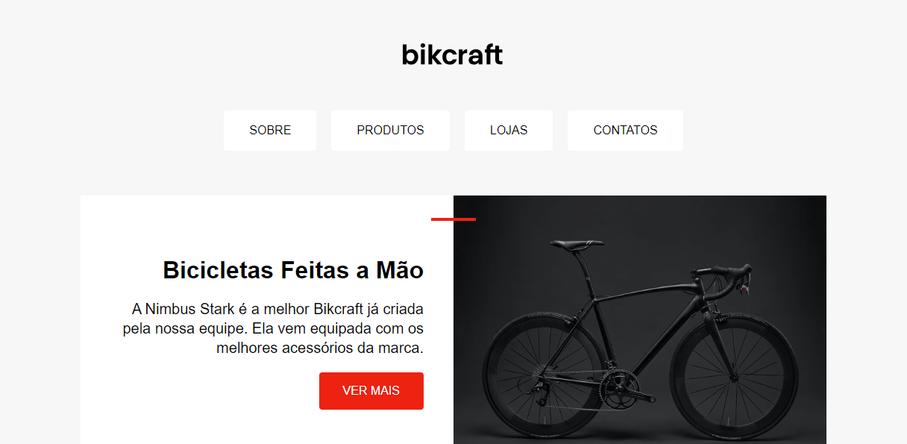
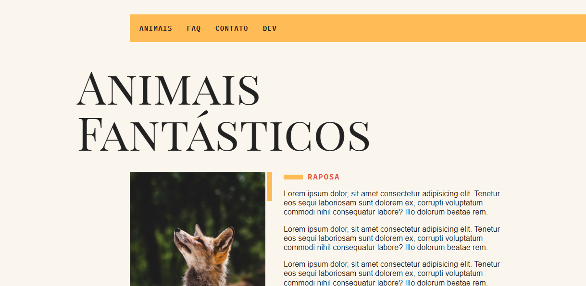

# Origamid

Cursos Origamid - Projetos realizados durante o curso:

## HTML e CSS

[Bikcraft](https://andressakaren.github.io/Origamid/HTML_CSS/03-Posicionamentos/)

## JavaScript

[Animais Fantásticos](https://andressakaren.github.io/Origamid/JavaScript/Projeto_01)

